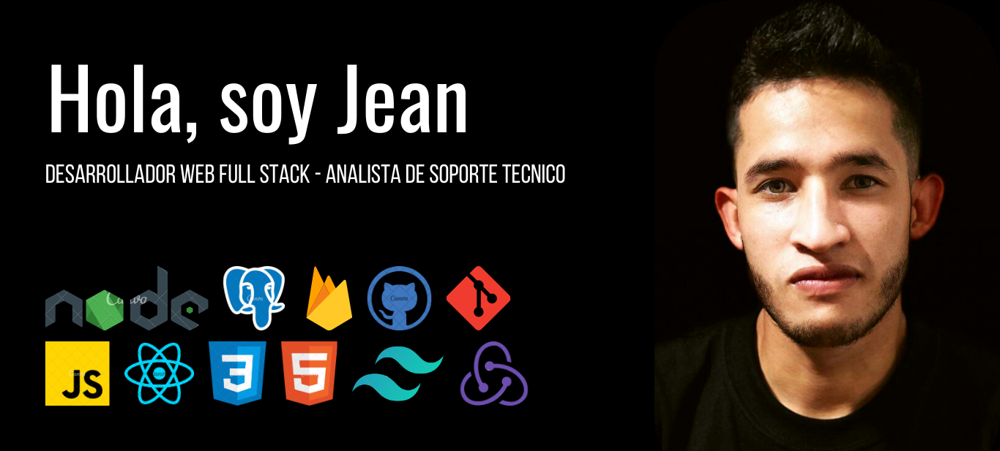

___


---

```javascript
console.log("¡Un placer tenerte por aqui!");
```

[Soy Jean](https://github.com/jeangq24 "GitHub de Jean Garzon") 👋, interesado por el mundo de la tecnolgia, me gusta aprender y dedicar tiempo a superarme. Me especialicé en el desarrollo web del lado del cliente y del servidor junto a bases de datos relacionales y no relacionales, mi fuerte es javascript pero no estoy cerrado a una sola tecnología, también tengo experiencia con el soporte técnico.

## Mis habilidades

 


## Contacto

Puedes **contactarme** haciendo **click** en cualquiera de los siguientes canales:

<a href="https://www.linkedin.com/in/jeangq24" target="_blank"></a>
 <a href="https://github.com/jeangq24" target="_blank"> </a>
<a href='mailto:jeangarzon24@gmail.com'></a>

---

>Si lo puedes imaginar lo puedes programar - PROGRAMACION ATS.

```sql
SELECT * FROM people WHERE attitude = 'good'
```

```javascript
return;
```


